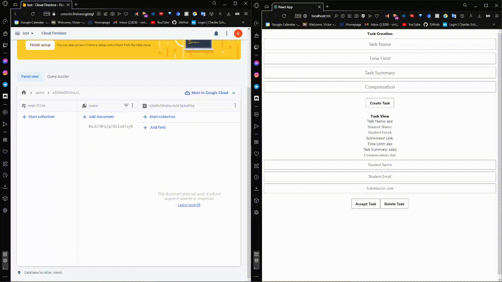

# TechIncubatorProject
Headstarter project by Victor Wu, and Kareem Virani

### Functions of the Project
- Connects to a Firebase database 
- Allows CRUD (Create, Read, Update, Delete) operations

### Specific Functions of the Project
- Allows the creation of a task, that has the task title, the summary, time limit, and compensation
- Allows someone to input their info into the task, so people can see who is doing the task
- Allows someone to delete a task if they wish to remove it from the server, or if the task has been completed

### Future Improvements for the Project
- Make the UI better looking, more interactive
- Have User Authentication, one user for people who create tasks, and delete tasks, and another for people who wish to only do tasks

